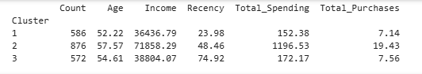
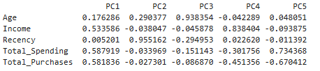
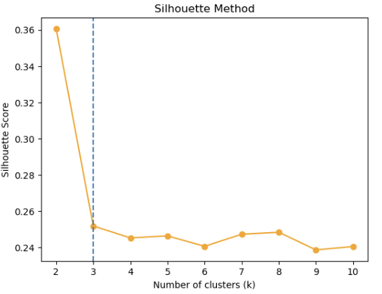
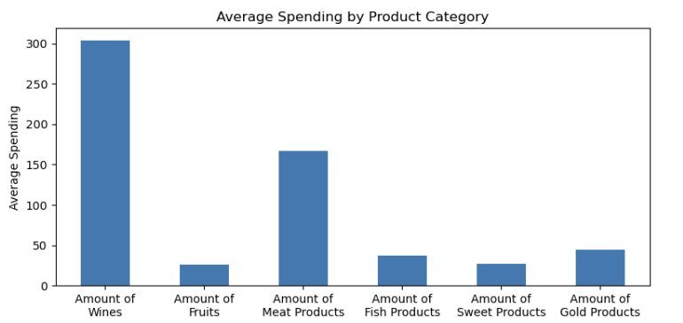

# customer-personality-analysis
Customer personality analysis using machine learning techniques to derive actionable customer segments
# Customer Personality Analysis

##  Overview
This project analyses customer demographic and behavioural data to uncover meaningful customer segments and spending patterns. Using machine learning techniques, the aim is to support data-driven marketing strategies through customer segmentation and insight generation.

---

##  Dataset
- Source: [Kaggle - Customer Personality Analysis Dataset](https://www.kaggle.com/datasets/imakash3011/customer-personality-analysis)
- Includes features such as income, demographics, and product spending behaviour

---

##  Methodology
- Cleaned and preprocessed the dataset, including handling missing values and preparing features for analysis  
- Conducted exploratory data analysis (EDA) to identify key patterns and relationships  
- Applied K-Means clustering to segment customers based on demographic and spending behaviour  
- Selected the optimal number of clusters using silhouette score  
- Analysed cluster profiles to identify distinguishing characteristics across segments  

---

##  Key Results

### Cluster Visualisation

### Cluster Characteristics

### Model Selection (Silhouette Score)

### Spending Behaviour by Category

---

##  Key Insights
- Distinct customer segments were identified based on income and spending behaviour  
- Certain clusters exhibit significantly higher spending in specific product categories  
- These segments can be leveraged for targeted marketing and personalised strategies  
- Feature patterns highlight key drivers of customer behaviour  

---

##  Tools Used
- Python (Pandas, NumPy, Scikit-learn)  
- Matplotlib / Seaborn  
- Jupyter Notebook  

---
##  Report
A detailed analysis and findings are available in the project report:
- `220658043_ST3189 Coursework Report`
